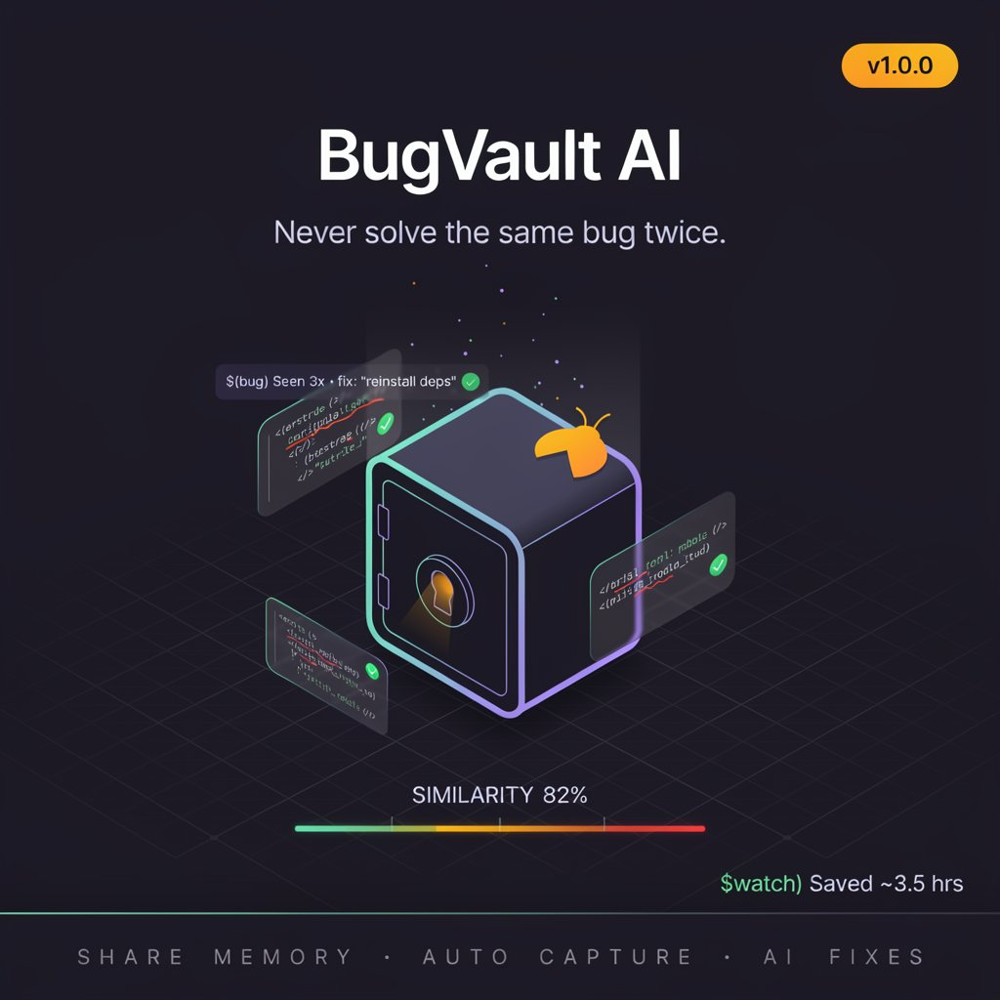

# BugVault AI



BugVault AI is an automatic bug memory system for VS Code that acts as your personal — and team — debugging assistant. It actively monitors your workflow, detects errors, and remembers their solutions so you never solve the same bug twice.

Whether you're dealing with terminal crashes, compilation errors, or code diagnostics, BugVault AI captures the context, uses AI to generate and store solutions, and shares that knowledge across your entire team through Shared Memory Mode.

**Version 1.0.0** · [Changelog](#-changelog)

---

## 🌟 Features

### Core
- **Automatic Error Capture** — Seamlessly monitors your terminal, code diagnostics (Problems tab), and build tasks. Errors are fingerprinted and stored silently.
- **AI-Powered Solutions** — When you mark a bug as solved, BugVault uses VS Code's built-in Language Model API (Copilot, etc.) to generate a rich fix description, focused on your `git diff HEAD` and kept concise.
- **Semantic Memory Matching** — Powered by SQLite + Supermemory, BugVault semantically matches new errors against known ones, even when the exact error text differs.
- **Granular Task Bug Tracking** — Build task failures are tracked by both task name *and* exit code, so a task failing for a new reason isn't matched against a stale, unrelated fix.
- **Resilient Memory Layer** — If Supermemory (personal or shared) is unreachable, matching gracefully falls back to fingerprint-only detection instead of crashing the capture pipeline.

### UI & Feedback
- **Inline CodeLens Annotations** — A `$(bug) Seen Nx · fix: "..."` hint appears directly above a failing line when a repeated bug is detected, and disappears once resolved.
- **AI Confidence Bar** — For semantic matches, a WebView card shows an animated similarity bar (green ≥ 80%, amber 55–79%, red < 55%) with full context and the stored fix. Always shows fresh data, even on repeat opens.
- **Time Saved Counter** — Every caught repeat logs ~15 minutes saved. The status bar shows a live total: `$(watch) Saved ~3.5 hrs`.
- **BugVault Sidebar** — Browse recent bugs in a dedicated tree panel, with colour-coded icons (green = solved, red = active) and markdown tooltips. Use **Clear Solved** in the panel toolbar to hide resolved bugs from the list.
- **Rich Bug Detail View** — Status badges, meta chips, a git timeline row, and colored error/fix blocks. Panels are reused per bug instead of spawning duplicates, and refresh automatically after actions.
- **Editable Solutions** — Manually edit any AI-generated fix at any time; empty input is treated as a validation warning, not a silent cancel.

### Team / Shared Memory Mode
- **Shared Knowledge Base** — Point BugVault at a central Supermemory instance so every developer benefits from fixes discovered by teammates.
- **Team Fix Attribution** — Shared-vault fixes are labelled `👥 Team fix` in popups and `👥 Team Memory` on the confidence card.
- **Seamless Sync on Solve** — Fixes are pushed to the shared (or personal) vault automatically when a bug is marked solved, including back-filling bugs captured before shared mode was enabled.
- **Status Bar Indicator** — Shows a `👥` icon and "Team Memory ON" tooltip when shared mode is active.

---

## 🚀 Getting Started

### Prerequisites

1. **VS Code 1.90+** — Required for the built-in Language Model API.
2. **Node.js & npm** — Required to build the extension.
3. **Supermemory Local** — Used for semantic search. Run one locally (default `http://localhost:6767`) or point to a shared server. The extension still works without it, using fingerprint-only matching.
4. **AI Access** — VS Code Copilot or another provider exposing language models via the VS Code LM API.

### Option A — Install the packaged VSIX

```bash
# From VS Code command palette:
# Extensions: Install from VSIX…
# Select: bugvault-ai-1.0.0.vsix
# npx @vscode/vsce package 2>&1

# Or via CLI:
code --install-extension ./bugvault-ai-1.0.0.vsix
```

### Option B — Build from source

```bash
git clone <repository-url>
cd BugVault
npm install
npm run compile
```

Open the project in VS Code and press `F5` to launch the Extension Development Host.

---

## ⚙️ Configuration

Open VS Code Settings (`Ctrl+,` / `Cmd+,`) and search for `BugVault`.

| Setting | Default | Description |
|---|---|---|
| `bugvault.supermemoryUrl` | `http://localhost:6767` | URL of your **personal** local Supermemory instance. |
| `bugvault.similarityThreshold` | `0.82` | Minimum semantic similarity (0–1) to treat a new bug as a repeat. |
| `bugvault.enableAutoCapture` | `true` | Toggle automatic capture of terminal, diagnostic, and build errors. |
| `bugvault.sharedMemory.enabled` | `false` | Enable Team/Shared Memory Mode. |
| `bugvault.sharedMemory.url` | `http://localhost:6767` | URL of the **shared team** Supermemory instance. |

### Setting Up Shared Memory Mode

1. Deploy a Supermemory instance accessible to all developers.
2. Set `bugvault.sharedMemory.url` to your server URL.
3. Toggle `bugvault.sharedMemory.enabled` to `true`.
4. Reload the window — BugVault now searches the shared vault first and pushes new fixes there.

> **Conflict resolution**: Last write wins. If two developers solve the same bug concurrently, the most recent fix is stored.

---

## 📖 Day-to-Day Workflow

1. **Code Normally** — BugVault captures errors silently in the background.
2. **See the Gutter Hint** — A CodeLens annotation appears above a failing line if it's a known bug.
3. **Get the Confidence Card** — AI-matched bugs slide in a WebView card with a similarity bar and stored fix (`👥 Team Fix` if shared).
4. **Mark as Solved** — From the sidebar or detail view. BugVault generates an AI fix from your code context + git diff and syncs it.
5. **Edit the Fix** — Refine the stored solution any time.
6. **Watch the Savings Grow** — Track `$(watch) Saved ~X hrs` in the status bar.

---

## 🛠️ Commands

Access via the Command Palette (`Ctrl+Shift+P` / `Cmd+Shift+P`):

| Command | Description |
|---|---|
| `BugVault: Open Bug Vault Panel` | Opens the sidebar panel. |
| `BugVault: Mark as Solved` | Marks the bug solved, triggers AI solution generation + memory sync. |
| `BugVault: Edit Fix` | Manually edit the stored fix. |
| `BugVault: Show Related Bugs` | Opens the detailed webview for a bug. |
| `BugVault: Clear Solved` | Hides solved bugs from the sidebar panel. |

---

## 🗂️ Architecture Overview

```
BugVault AI
├── capture/          # Error sources: terminal, diagnostics, tasks
│   ├── bugEvent.ts        — Event type (carries taskName + exitCode)
│   ├── terminalWatcher     — Watches terminal output
│   ├── diagnosticsWatcher  — Watches Problems panel (capped 1 error/file)
│   └── taskWatcher         — Watches VS Code tasks (exit-code aware)
├── db/
│   ├── bugRepository.ts    — SQLite CRUD for bugs (+ updateMemoryId, framework col)
│   └── statsRepository.ts  — SQLite counter for time-saved stats
├── memory/
│   ├── supermemoryClient   — HTTP client for Supermemory API
│   ├── matchEngine.ts      — Fingerprint + semantic search (shared-first, fallback-safe)
│   └── memoryTypes.ts      — Shared types (MatchOutcome with fromShared/teamFix)
├── lifecycle/
│   ├── bugTracker.ts       — Tracks active bugs; resolves on exit-code change
│   └── fixCapture.ts       — Prompts fix capture on resolution (shared-mode aware)
├── ui/
│   ├── bugCodeLens.ts       — Inline gutter CodeLens provider
│   ├── confidencePopup.ts   — WebView confidence bar card (always fresh, Team Memory badge)
│   ├── popupNotifier.ts     — Toast notification (Team Fix label)
│   ├── statusBarIndicator   — Bug count + time saved + shared mode indicator
│   ├── bugDetailView.ts     — Detailed bug webview (panel reuse per bug id)
│   └── bugVaultPanel.ts     — Sidebar tree view
├── commands/
│   └── registerCommands     — markSolved, saveFix (shared memory-aware sync)
└── utils/
    └── config.ts            — All settings getters incl. shared memory helpers
```

---

## 📦 Publishing (maintainers)

1. Create a publisher at https://marketplace.visualstudio.com/manage
2. Get a Personal Access Token (PAT) from Azure DevOps
3. Run:
   ```bash
   npx @vscode/vsce login biki-dev
   npx @vscode/vsce publish
   ```

---

## 📋 Changelog

### 1.0.0
- Fixed stale panel data on repeat opens (confidence popup, bug detail view)
- Bug detail panels now reused per bug ID instead of duplicating
- Fixed `framework` column missing from SQLite insert
- Added fallback to personal Supermemory when shared instance is unreachable
- Wrapped memory writes in try/catch so local tracking survives a Supermemory outage
- Capped diagnostics capture to 1 error per file to prevent notification spam
- Fixed `fixCapture` prompting even when a bug was already auto-resolved
- Fixed empty-string vs cancel handling in `saveFix`
- Added `bugvault.clearSolved` command and sidebar toolbar button
- New icon, MIT license, tightened `.vscodeignore`, marketplace metadata

---

## 🤝 Contributing

Contributions, issues, and feature requests are welcome! Feel free to open an issue or submit a pull request.

## 📝 License

This project is licensed under the MIT License.